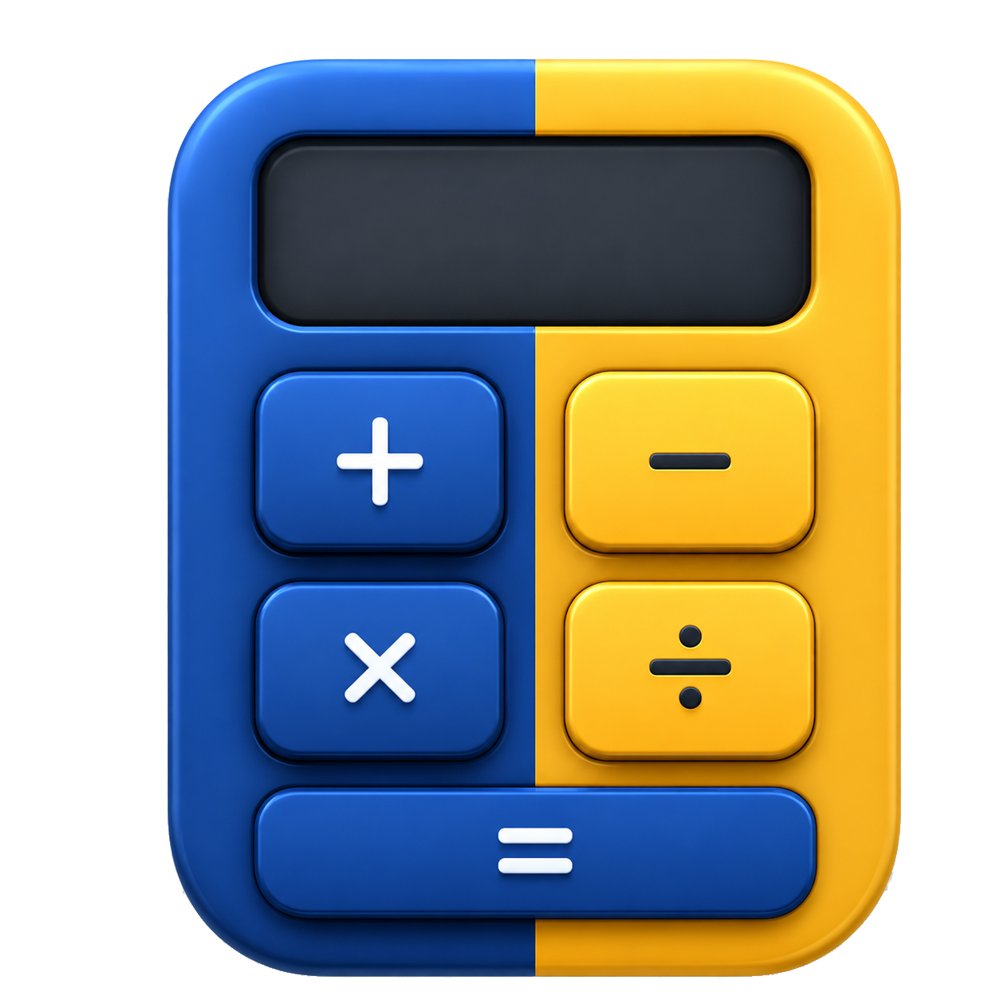

<div align="center">



# PyCalc

**Calculadora desktop modular em Python/Tkinter, inspirada na experiência da Calculadora do Windows e construída como projeto autoral.**


</div>

> [!IMPORTANT]
> O **PyCalc v1.0.0** está publicado e funcionando normalmente.  
> O projeto segue em evolução com novas melhorias, ajustes visuais, ampliação de testes e refinamentos de empacotamento.

> [!WARNING]
> No Windows, o instalador pode ser bloqueado ou sinalizado pelo **Windows Defender / SmartScreen** por ainda não possuir assinatura digital de código.  
> Isso pode acontecer com aplicativos independentes distribuídos fora da Microsoft Store, especialmente quando são projetos novos ou pouco conhecidos.  
> Baixe o PyCalc apenas pelo repositório oficial do autor. Caso o Windows impeça a instalação, a alternativa recomendada é executar o projeto diretamente pelo código-fonte ou aguardar uma versão futura assinada digitalmente.

## Demonstração

> Demonstração visual em preparação. Screenshots ou GIFs reais da interface podem ser adicionados nesta seção para mostrar os modos, conversores, temas e principais recursos do PyCalc.

## Índice

- [Sobre o projeto](#sobre-o-projeto)
- [Funcionalidades](#funcionalidades)
- [Tecnologias utilizadas](#tecnologias-utilizadas)
- [Estrutura do projeto](#estrutura-do-projeto)
- [Requisitos](#requisitos)
- [Download e instalação](#download-e-instalação)
- [Como executar pelo código-fonte](#como-executar-pelo-código-fonte)
- [Aviso sobre Windows Defender e SmartScreen](#aviso-sobre-windows-defender-e-smartscreen)
- [Builds e distribuição](#builds-e-distribuição)
- [Exemplos de uso](#exemplos-de-uso)
- [Atalhos de teclado](#atalhos-de-teclado)
- [Arquitetura](#arquitetura)
- [Testes](#testes)
- [Roadmap](#roadmap)
- [Contribuição](#contribuição)
- [Problemas e sugestões](#problemas-e-sugestões)
- [Autor](#autor)
- [Licença](#licença)
- [Agradecimentos](#agradecimentos)

## Sobre o projeto

O **PyCalc** é uma aplicação desktop de calculadora feita com **Python** e **Tkinter**. Ela reúne em uma única interface modos de cálculo comuns, científicos, gráficos, programadores, cálculo de datas e conversores de unidades.

A proposta do projeto é entregar uma experiência familiar para quem já usa calculadoras desktop, com navegação lateral, histórico, memória, atalhos de teclado e temas, mantendo o código organizado em módulos independentes. Essa separação permite evoluir cada modo sem concentrar toda a lógica em um único arquivo.

Como projeto de portfólio, o PyCalc demonstra construção de interface gráfica, organização modular, tratamento de entradas matemáticas, conversão de unidades, integração com bibliotecas científicas, empacotamento para desktop e testes automatizados focados em partes críticas.

A versão **v1.0.0** marca a primeira versão publicada do projeto, com os principais modos e conversores já implementados e funcionais.

## Funcionalidades

### Modos de cálculo

- **Padrão:** operações aritméticas, porcentagem, raiz quadrada, quadrado, inverso, troca de sinal, memória e histórico.
- **Científica:** constantes, parênteses, potências, módulo, fatorial, funções logarítmicas, funções trigonométricas, funções hiperbólicas, conversão angular e alternância DEG/RAD/GRAD.
- **Representação gráfica:** editor de expressões, gráfico cartesiano com Matplotlib, zoom, arraste, redefinição de visualização, rastreamento de pontos, exportação PNG e suporte a expressões explícitas, implícitas e desigualdades.
- **Programador:** bases HEX/DEC/OCT/BIN, tamanhos QWORD/DWORD/WORD/BYTE, operações bit a bit, deslocamentos, visualização de bits e memória própria.
- **Cálculo de data:** diferença entre datas e adição/subtração de anos, meses e dias com seletor de calendário.

### Conversores

- Moeda, com taxas padrão locais e opção de atualização via `https://open.er-api.com/v6/latest/USD`.
- Volume, comprimento, peso e massa, temperatura, energia, área, velocidade, tempo, potência, dados, pressão e ângulo.
- Base genérica para conversores de unidades em `modos/conversor_unidades.py`.
- Entrada por teclado para números, separador decimal, sinal negativo quando permitido, backspace e limpeza.

### Interface

- Menu lateral animado com seções de calculadora e conversores.
- Tema claro, escuro ou baseado na preferência do sistema.
- Tela de configurações com seção de aparência e links do projeto.
- Ícones separados para modos e conversores em versões clara e escura.
- Cabeçalho compartilhado com ações contextuais por modo.
- Painéis de histórico e memória nos modos que implementam esses recursos.

### Memória e histórico

- Memória no modo Padrão e no modo Científico: `MC`, `MR`, `MS`, `M+`, `M-` e lista de valores salvos.
- Histórico de cálculos com recuperação de resultados no modo Padrão e no modo Científico.
- Memória dedicada no modo Programador, com painel de valores armazenados.

### Execução e empacotamento

- Execução direta por `calculadora.py`.
- Versão **v1.0.0** publicada.
- Scripts de empacotamento Windows via PyInstaller e Inno Setup.
- Script de build Linux capaz de gerar pacote portátil, `.deb` ou AppImage conforme as ferramentas disponíveis.
- Script auxiliar para chamar o build Linux a partir do WSL.

## Tecnologias utilizadas

| Tecnologia | Uso no projeto |
| --- | --- |
| Python | Linguagem principal da aplicação |
| Tkinter | Interface gráfica desktop |
| NumPy | Cálculo numérico no modo de representação gráfica |
| Matplotlib | Renderização do gráfico cartesiano embutido no Tkinter |
| SymPy | Parsing e validação de expressões matemáticas do modo gráfico |
| Decimal | Precisão em conversores e moedas |
| PyInstaller | Geração de executáveis desktop |
| Inno Setup | Instalador Windows |
| unittest | Testes automatizados existentes |

As dependências de execução estão em `requirements.txt`:

```text
numpy>=2.0
matplotlib>=3.9
sympy>=1.13
```

## Estrutura do projeto

```text
PyCalc/
├── calculadora.py
├── configuracoes.py
├── gerenciador_historico.py
├── gerenciador_memoria.py
├── interacao_teclado_visor.py
├── menu_lateral.py
├── operacoes.py
├── operacoes_cientificas.py
├── recursos.py
├── tema.py
├── requirements.txt
├── README.md
├── docs/
│   └── atalhos_calculadora.txt
├── icons/
│   ├── PyCalc_main.ico
│   ├── PyCalc_main.png
│   ├── modos_icons/
│   └── conversores_icons/
├── modos/
│   ├── padrao.py
│   ├── cientifica.py
│   ├── representacao_grafica.py
│   ├── grafico_motor.py
│   ├── programador.py
│   ├── data.py
│   ├── moeda.py
│   ├── conversor_unidades.py
│   └── outros conversores
├── packaging/
│   ├── inno/
│   ├── linux/
│   └── pyinstaller/
├── scripts/
└── tests/
```

As pastas `build/`, `dist/` e `release/` podem existir localmente depois dos builds, mas estão no `.gitignore` e não devem ser tratadas como código-fonte.

### Responsabilidade dos principais arquivos e pastas

| Caminho | Responsabilidade |
| --- | --- |
| `calculadora.py` | Inicializa a janela, registra os modos e coordena navegação, cabeçalho, configurações e troca de telas |
| `menu_lateral.py` | Menu lateral animado, seções de modos, conversores, ícones e rolagem |
| `modos/padrao.py` | Modo Padrão, operações principais, memória e histórico |
| `modos/cientifica.py` | Modo Científico, teclado expandido, trigonometria, funções e notação científica |
| `modos/representacao_grafica.py` | Interface do modo gráfico, editor, Matplotlib embutido e exportação PNG |
| `modos/grafico_motor.py` | Parser e compilador seguro de expressões para o modo gráfico |
| `modos/programador.py` | Modo Programador, bases numéricas, bits, word size, memória e operações bit a bit |
| `modos/data.py` | Cálculo de diferença entre datas e adição/subtração de períodos |
| `modos/moeda.py` | Conversor de moedas, taxas padrão e atualização online |
| `modos/conversor_unidades.py` | Base visual e lógica compartilhada pelos conversores de unidades |
| `gerenciador_memoria.py` | Componente reutilizável de memória para modos numéricos |
| `gerenciador_historico.py` | Painel de histórico e recuperação de resultados |
| `interacao_teclado_visor.py` | Atalhos, edição direta do visor e comandos de teclado |
| `configuracoes.py` | Preferências de tema, tela de configurações, links do projeto e detecção de tema no Windows |
| `tema.py` | Paleta, fontes e aplicação dos temas claro/escuro |
| `recursos.py` | Resolução de caminhos para recursos em execução normal ou empacotada |
| `packaging/` | Arquivos de PyInstaller, Inno Setup e desktop entry Linux |
| `scripts/` | Scripts para builds Windows, instalador e Linux |
| `tests/` | Testes automatizados de conversores e do motor gráfico |
| `docs/atalhos_calculadora.txt` | Referência detalhada dos atalhos atualmente implementados |

## Requisitos

### Para usar a versão instalada

- Windows 10/11 64-bit para o instalador Windows.
- Linux 64-bit para os pacotes Linux, quando disponíveis.

### Para executar pelo código-fonte

- Python 3.10 ou superior.
- Tkinter disponível na instalação do Python.
- Dependências listadas em `requirements.txt`.
- Git, caso o repositório seja clonado pelo terminal.

No Linux, se o Tkinter não estiver instalado:

```bash
sudo apt install python3-tk
```

Para verificar o Tkinter:

```bash
python -m tkinter
```

## Download e instalação

A versão publicada do projeto está disponível na seção de releases do repositório:

```text
https://github.com/Vinicius-Stenico/PyCalc/releases
```

### Windows

Baixe o instalador da versão mais recente:

```text
PyCalc_Setup.exe
```

Depois, execute o instalador normalmente.

> [!NOTE]
> Caso o Windows Defender ou SmartScreen bloqueie a instalação, consulte a seção [Aviso sobre Windows Defender e SmartScreen](#aviso-sobre-windows-defender-e-smartscreen).

### Linux

Dependendo dos artefatos disponíveis na release, use uma das opções abaixo.

#### Pacote `.deb`

```bash
sudo apt install ./pycalc_1.0.0_amd64.deb
```

#### AppImage

```bash
chmod +x PyCalc-1.0.0-x86_64.AppImage
./PyCalc-1.0.0-x86_64.AppImage
```

#### Versão portátil

```bash
tar -xzf PyCalc-1.0.0-linux-x86_64.tar.gz
cd PyCalc
./PyCalc
```

## Como executar pelo código-fonte

Clone o repositório:

```bash
git clone https://github.com/Vinicius-Stenico/PyCalc.git
cd PyCalc
```

### Ambiente virtual no Windows

```cmd
python -m venv .venv
.venv\Scripts\activate
python -m pip install --upgrade pip
python -m pip install -r requirements.txt
python calculadora.py
```

### Ambiente virtual no Linux

```bash
python3 -m venv .venv
source .venv/bin/activate
python -m pip install --upgrade pip
python -m pip install -r requirements.txt
python3 calculadora.py
```

## Aviso sobre Windows Defender e SmartScreen

O instalador do PyCalc pode ser bloqueado ou sinalizado pelo **Windows Defender / SmartScreen** em algumas máquinas.

Isso ocorre porque a versão atual ainda não possui um certificado de assinatura digital de código. Sem essa assinatura, o Windows pode tratar o instalador como um aplicativo desconhecido, mesmo que ele tenha sido gerado a partir do código deste repositório.

Esse aviso não significa necessariamente que o programa esteja com problema, mas é uma proteção normal do Windows para executáveis novos, independentes ou pouco reconhecidos.

Recomendações:

- baixe o instalador somente pela página oficial de releases deste repositório;
- não execute cópias recebidas por terceiros ou baixadas de fontes desconhecidas;
- se preferir não instalar o executável, rode o projeto diretamente pelo código-fonte;
- em versões futuras, o projeto pode receber assinatura digital para reduzir esse tipo de bloqueio.

## Builds e distribuição

A versão **v1.0.0** já foi publicada, mas o repositório também mantém scripts para gerar builds locais.

### Windows

Script disponível para gerar o executável com PyInstaller:

```powershell
python -m pip install pyinstaller
.\scripts\build_exe.ps1
```

Quando concluído, o build é gerado em:

```text
dist\PyCalc\PyCalc.exe
```

Script disponível para gerar o instalador Windows:

```powershell
.\scripts\build_installer.ps1
```

Requisito adicional: **Inno Setup 6** instalado. O instalador é configurado para sair em:

```text
release\PyCalc_Setup.exe
```

> [!NOTE]
> Builds locais gerados sem assinatura digital também podem acionar alertas do Windows Defender / SmartScreen.

### Linux

Script disponível para gerar builds Linux:

```bash
bash scripts/build_linux.sh
```

O script cria um ambiente `.venv-linux`, instala as dependências, roda PyInstaller e pode gerar os artefatos abaixo conforme as ferramentas disponíveis:

- `release/linux/PyCalc-<versão>-linux-<arquitetura>.tar.gz`
- `release/linux/pycalc_<versão>_<arquitetura>.deb`, quando `dpkg-deb` está disponível
- `release/linux/PyCalc-<versão>-<arquitetura>.AppImage`, quando `appimagetool` está disponível

No Windows com WSL configurado, há um script auxiliar:

```powershell
.\scripts\build_linux_from_wsl.ps1
```

## Exemplos de uso

### Cálculo básico

```text
25 + 17 =
```

Resultado:

```text
42
```

### Porcentagem

```text
200 × 10 % =
```

Resultado esperado no fluxo do modo Padrão:

```text
20
```

### Memória

```text
50
MS
25
M+
MR
```

Esse fluxo salva `50`, soma `25` à memória e recupera `75`.

### Histórico

Depois de realizar cálculos no modo Padrão ou Científico, use o botão de histórico no topo da janela ou `Ctrl+H` para abrir/fechar o painel. Um resultado do histórico pode ser recuperado para o visor.

### Modo científico

Exemplos compatíveis com o teclado científico:

```text
sin(90) em DEG
log(100)
5 n!
2 xʸ 8 =
```

### Conversores

Exemplos:

```text
Comprimento: centímetros → metros
Temperatura: Celsius → Fahrenheit
Dados: megabyte → kilobyte
Ângulo: grau → radiano
```

### Modo programador

Exemplos:

```text
Alternar DEC para HEX
Aplicar AND, OR, XOR ou NOT
Mudar QWORD para DWORD, WORD ou BYTE
Usar a visualização de bits para alternar posições individuais
```

### Cálculo de datas

Exemplos:

```text
Diferença entre duas datas
Adicionar 1 ano, 2 meses e 10 dias a uma data
Subtrair um período de uma data base
```

### Representação gráfica

Exemplos aceitos pelo motor gráfico:

```text
y=x
x^2
sin(x)
x^2+y^2=25
y>x^2
```

O modo gráfico também permite ajustar limites dos eixos, unidade angular, espessura da linha, tema do gráfico e exportar a visualização como PNG.

## Atalhos de teclado

Esta seção lista apenas os atalhos principais. A referência completa fica em [`docs/atalhos_calculadora.txt`](docs/atalhos_calculadora.txt).

| Ação | Tecla |
| --- | --- |
| Inserir números | `0` a `9` |
| Separador decimal | `.` ou `,` |
| Soma | `+` |
| Subtração | `-` |
| Multiplicação | `*` ou `X` |
| Divisão | `/` |
| Resultado | `Enter` ou `=` |
| Porcentagem | `%` |
| Apagar último caractere | `Backspace` |
| Limpar tudo (`C`) | `Esc` |
| Trocar sinal | `F9` |
| Abrir/fechar histórico | `Ctrl+H` |
| Salvar/recuperar/limpar memória | `Ctrl+M`, `Ctrl+R`, `Ctrl+L` |
| Somar/subtrair memória | `Ctrl+P`, `Ctrl+Q` |
| Alternar unidade angular no modo Científica | `F3`, `F4`, `F5` |

## Arquitetura

```text
calculadora.py
    ├── cabeçalho, menu lateral, configurações e troca de modos
    ├── modos/
    │   ├── calculadoras numéricas
    │   ├── conversores
    │   ├── datas
    │   ├── programador
    │   └── representação gráfica
    ├── gerenciador_memoria.py
    ├── gerenciador_historico.py
    ├── interacao_teclado_visor.py
    ├── tema.py
    └── recursos.py
```

A aplicação separa responsabilidades por modo e por componente compartilhado. O arquivo `calculadora.py` funciona como coordenador: ele cria a janela principal, registra as classes disponíveis, alterna telas e entrega ações de topo ao modo ativo.

Os modos numéricos usam componentes compartilhados de memória, histórico e teclado. Os conversores herdam uma base comum para reduzir duplicação. O modo gráfico separa interface e motor de expressões, mantendo validação e parsing matemático em `modos/grafico_motor.py`.

## Testes

O projeto possui testes com `unittest` para:

- conversores de volume, comprimento, peso e massa, temperatura, energia, área, velocidade, tempo, potência, dados, pressão e ângulo;
- motor gráfico, incluindo funções explícitas, expressões implícitas, desigualdades, funções matemáticas e rejeição de entradas inseguras.

Para executar:

```bash
python -m unittest discover
```

## Roadmap

### Implementado na v1.0.0

- [x] Estrutura modular da aplicação.
- [x] Modo Padrão.
- [x] Modo Científico.
- [x] Modo de Representação gráfica.
- [x] Modo Programador.
- [x] Cálculo de datas.
- [x] Conversores de moeda, volume, comprimento, peso e massa, temperatura, energia, área, velocidade, tempo, potência, dados, pressão e ângulo.
- [x] Memória e histórico nos modos numéricos principais.
- [x] Tema claro, escuro e preferência do sistema.
- [x] Menu lateral com ícones por tema.
- [x] Atalhos de teclado documentados.
- [x] Scripts de build para Windows e Linux.
- [x] Testes automatizados para conversores e motor gráfico.
- [x] Primeira release pública do projeto.

### Em desenvolvimento

- [ ] Revisão visual fina dos modos mais densos.
- [ ] Ampliação dos testes para modos de interface e fluxos de cálculo.
- [ ] Melhorias no empacotamento e distribuição.
- [ ] Redução de alertas do Windows Defender / SmartScreen por meio de assinatura digital em versões futuras.
- [ ] Capturas de tela ou GIFs reais para a documentação.

### Planejado

- [ ] Documentação técnica mais detalhada por módulo.
- [ ] Revisão de acessibilidade e navegação completa por teclado.
- [ ] Melhor descrição de erros para entradas inválidas em todos os modos.

### Ideias futuras

- [ ] Persistência opcional de histórico e memória entre execuções.
- [ ] Internacionalização.
- [ ] Tema visual personalizável além dos presets claro/escuro.
- [ ] Distribuição com assinatura digital de código.

## Contribuição

Contribuições são bem-vindas, principalmente em:

- correção de bugs;
- melhorias na documentação;
- testes;
- sugestões de interface;
- validação de instalação em diferentes sistemas;
- melhorias de empacotamento.

Este projeto, porém, **não é open source**. O código é disponibilizado publicamente para fins de visualização, estudo e avaliação de portfólio.

Ao enviar uma issue, sugestão, pull request ou qualquer contribuição para este repositório, você concorda que a contribuição poderá ser analisada, adaptada e incorporada ao PyCalc pelo autor do projeto, sem que isso transfira a propriedade do projeto ou conceda permissão para copiar, vender, redistribuir ou reutilizar partes significativas do código sem autorização prévia.

Contribuições aceitas passam a fazer parte do projeto PyCalc, respeitando os termos definidos no arquivo `LICENSE`. E podem receber créditos no README, em releases ou em um arquivo CONTRIBUTORS.md.

Fluxo sugerido para contribuições:

```bash
git checkout -b feature/nome-da-melhoria
python -m unittest discover
git add .
git commit -m "feat: descreve a melhoria"
git push origin feature/nome-da-melhoria
```

Depois, abra um Pull Request explicando a motivação, as mudanças feitas e como foram testadas.

## Problemas e sugestões

Encontrou um erro ou tem uma sugestão? Abra uma issue:

[Abrir issue no GitHub](https://github.com/Vinicius-Stenico/PyCalc/issues/new)

Ao relatar um problema, inclua quando possível:

- sistema operacional;
- versão do Python;
- modo da calculadora usado;
- passos para reproduzir;
- comportamento esperado;
- comportamento observado;
- mensagens exibidas no terminal;
- captura de tela, se ajudar;
- se o problema ocorreu na versão instalada, portátil ou executada pelo código-fonte.

## Autor

Desenvolvido por **Vinícius Stenico**.

- GitHub: [Vinicius-Stenico](https://github.com/Vinicius-Stenico)
- Repositório: [github.com/Vinicius-Stenico/PyCalc](https://github.com/Vinicius-Stenico/PyCalc)
- LinkedIn: [Vinicius-Stenico](https://www.linkedin.com/in/viniciusstenico)

## Licença

Este projeto não possui uma licença open source.

O código-fonte é disponibilizado publicamente apenas para fins de visualização, estudo e avaliação de portfólio. Não é permitido copiar, modificar, redistribuir, vender ou utilizar partes significativas deste projeto sem autorização prévia e por escrito do autor.

Consulte o arquivo LICENSE para mais detalhes.

## Agradecimentos

- Documentação oficial do Python, Tkinter, Matplotlib, NumPy e SymPy.
- Calculadora do Windows, usada como referência visual e funcional.
- Comunidade Python, por materiais, discussões e exemplos que apoiam a evolução do projeto.

<div align="center">

**PyCalc - uma calculadora desktop modular feita para evoluir.**

</div>
